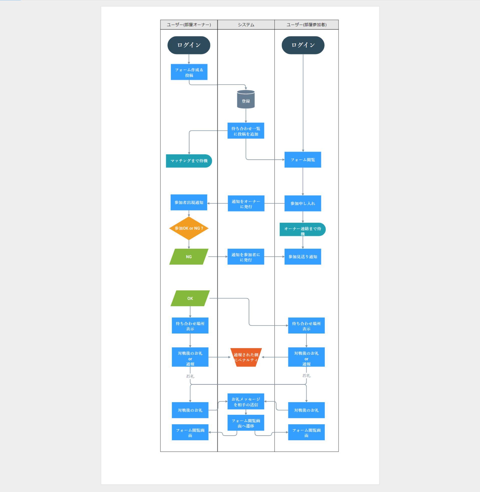
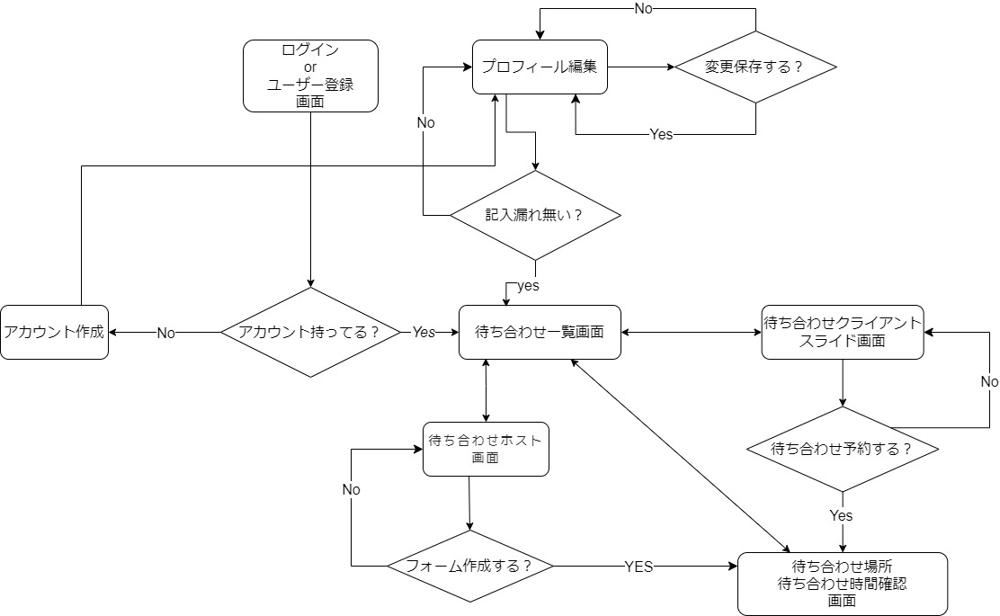

業務フロー

--------------------------------------------------------------------------------------
待ち合わせオーナー : 待ち合わせフォームを作成→登録
										 待ち合わせ情報確認→応募者が参加するのを待機 (or 作成したフォームを削除)
										 
										 参加申し入れ受理→待ち合わせ場所表示。待ち合わせ場所へ移動
										 (この間新たにオーナーやクライアントとして参加申し入れやフォームの作成を出来ないように）
										 
										 参加申し入れ却下→応募者へ参加申し入れ却下を連絡
										 対戦後にお礼 or 報告

待ち合わせクライアント: 待ち合わせフォームを閲覧→詳細を確認
												待ち合わせ情報＆対戦相手情報確認→募集者に参加申し入れ(→本当に申し入れしますか？）
												参加申し入れ受理→待ち合わせ場所表示。待ち合わせ場所へ移動
												(この間新たにオーナーやクライアントとして参加申し入れやフォームの作成を出来ないように）
												
												参加申し入れ却下→オーナーからの却下の連絡を受理
												対戦後にお礼 or 報告
												
石山（開発者）(運営）: 報告を受理→報告内容からクライアントorオーナーにペナルティを付与

----------------------------------------------------------------------------------------

画面遷移図

ワイヤーフレーム

[wireframe](https://app.moqups.com/UW5eKXGNf299ulViBxvfK98MjMUiq9Nt/edit/page/a29d6f3c2)

